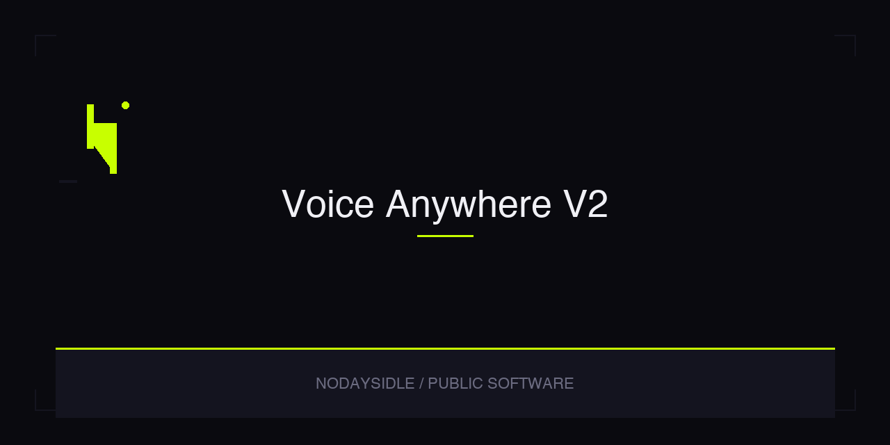

<h1 align="center">Voice Anywhere V2</h1>

<p align="center">
  Overlay mic. Speak into any app. Words land at the cursor.
</p>

<p align="center">
  <a href="https://github.com/nodaysidle/nodaysidle-voice-anywhere-v2/releases/download/v0.4.0/VoiceAnywhere-0.4.0.apk"><strong>Download v0.4.0 debug APK</strong></a>
  ·
  <a href="https://github.com/nodaysidle/nodaysidle-voice-anywhere-v2/releases/tag/v0.4.0">v0.4.0 release</a>
  ·
  <a href="https://github.com/nodaysidle/nodaysidle-voice-anywhere-v2/releases">All releases</a>
</p>

<p align="center">
  
  
  
  
  
</p>

## The loop

Voice Anywhere exists for one path: speech becomes text at the cursor in whatever app you already have open.

```text
Tap overlay pill (field focused)
  → STT (OpenRouter nova-3 if keyed → FUTO if installed → system ACTION_RECOGNIZE_SPEECH)
  → local clean (TextPostProcessor)
  → insert at cursor   ← paste path ends here
       SET / PST when Accessibility is BOUND
       IME commitText when Access bind is dead and Voice Anywhere IME is selected
       clipboard + notification last resort only

Optional DeepSeek polish (if keyed)
  → runs in the background AFTER insert
  → result is dropped — never written back
```

| Stage | What happens |
|---|---|
| **Focus** | Tap an editable field in any app. No field → pill shows `NO FIELD` and does not record (when Access is BOUND and guarding focus). |
| **Speak** | Tap the floating pill. Idle shows language tag (`EN` / `IT` / `SL`). Recording shows language + waveform inside the pill. Long-press cycles language. |
| **Transcribe** | OpenRouter `deepgram/nova-3` when an OpenRouter key is set; else FUTO if installed; else system `ACTION_RECOGNIZE_SPEECH` with **no** `setPackage`. FUTO is optional — never required, never blocks ready. |
| **Clean** | Offline `TextPostProcessor` runs before insert. |
| **Insert** | Cursor first: `ACTION_SET_TEXT` / `ACTION_PASTE` when Accessibility is BOUND; Voice Anywhere IME `commitText` at cursor when Access bind is dead and the IME is selected; clipboard + private notification only as last resort. Pill flashes `✓ SET` / `✓ PST` / `✓ IME` / `↗ CPY`. |
| **Polish (optional)** | DeepSeek, if keyed, runs after insert in the background. Output is **not** written back into the field. |

Android only (`com.nodaysidle.voiceanywhere`; published debug APK is `com.nodaysidle.voiceanywhere.debug`). OpenRouter and DeepSeek keys live in Android Keystore when set. Opt-in local transcript history if you turn it on (off by default; disabling clears saved transcripts).

### Xiaomi / persist

The pill is hosted by `FloatingMicOverlay` on `VoiceKeepAliveService` via `TYPE_APPLICATION_OVERLAY` (draw-over-other-apps grant). It is **not** only a `TYPE_ACCESSIBILITY_OVERLAY` inside `onServiceConnected`.

- **ACCESS tile:** `BOUND` / `DEAD` / `ENABLE`. Never show `ENABLED` when Settings lists the service but Bound is empty (Xiaomi FGSA CAPS DEAD).
- **IME:** `VoiceInputMethodService`. Enable once in system keyboards. Gboard can stay default for typing. IME is the cursor path when Access bind dies.
- Does **not** skip Xiaomi’s 15-second Accessibility confirm. Does not silently enable Accessibility.
- First-run grants: Microphone, Overlay (draw over other apps), Accessibility (15s confirm once), IME enable, battery unrestricted / Xiaomi autostart.
- After that, you should not reopen Accessibility every session. If Xiaomi later kills the bind, overlay + IME keep the pill and cursor insert without going back into Accessibility Settings.

## What’s on screen (v0.4.0)

Phone-tested on a **Xiaomi M2007J3SY** (Android 12). Cursor paste landed.

| Surface | Role in the loop |
|---|---|
| **Floating pill** | 60dp Material 3 dark stadium over every app. Idle: language tag (`EN` / `IT` / `SL`). Recording: language + waveform inside the pill. No extra labels. Feedback: SET / PST / IME / CPY / `NO FIELD`. |
| **Setup tiles** | ACCESS, OVERLAY, IME, BATTERY — honest status (ACCESS never fakes ENABLED when unbound). |
| **Setup screen** | Permissions, overlay / Accessibility / IME / battery actions, OpenRouter key, DeepSeek key, opt-in history. |
| **History (opt-in)** | Copy / retry / delete recent transcripts when enabled. |

**Not on the pill:** language picker UI beyond the long-press `EN` → `IT` → `SL` cycle. No second tap for FUTO language when FUTO is used — auto-select handles it.

## STT (OpenRouter)

| Priority | Engine | When |
|---|---|---|
| 1 | OpenRouter `deepgram/nova-3` | OpenRouter API key set (Keystore). In-pill AAC record → cloud transcription. |
| 2 | FUTO Voice Input | Key blank **and** FUTO installed. Optional — missing FUTO does not block ready. |
| 3 | System `ACTION_RECOGNIZE_SPEECH` | No key, no FUTO. Intent launched **without** `setPackage`. |

Languages passed as `en-US` / `it-IT` / `sl-SI` (OpenRouter ISO-639-1: `en` / `it` / `sl`). Network is required only when OpenRouter STT or DeepSeek polish keys are set — do not claim “no internet required.”

## Stack

| Layer | Technology |
|---|---|
| Language | Kotlin |
| Min SDK | API 31 (Android 12+) |
| Overlay | `TYPE_APPLICATION_OVERLAY` on keep-alive FGS + Accessibility helper |
| IME | `VoiceInputMethodService` (cursor insert when Access bind is dead) |
| Keep-alive | Foreground service (`VoiceKeepAliveService`) |
| STT | OpenRouter `deepgram/nova-3` → optional FUTO → system `ACTION_RECOGNIZE_SPEECH` |
| Text insertion | SET / PST (a11y BOUND) → IME → clipboard + notification |
| Keys | Android Keystore (OpenRouter, DeepSeek) |
| Build | Gradle (Kotlin DSL) |

## Install the APK

The published artifact is a **debug** build — version **0.4.0** (`versionCode` 4), package `com.nodaysidle.voiceanywhere.debug`.

1. Download [`VoiceAnywhere-0.4.0.apk`](https://github.com/nodaysidle/nodaysidle-voice-anywhere-v2/releases/download/v0.4.0/VoiceAnywhere-0.4.0.apk) from the [v0.4.0 release](https://github.com/nodaysidle/nodaysidle-voice-anywhere-v2/releases/tag/v0.4.0).
2. Sideload on Android 12+ (API 31). Allow install from unknown sources for your file manager/browser.
3. Open the app → grant **Microphone** (and **Notifications** on Android 13+ for clipboard fallback alerts).
4. Grant **Overlay** (draw over other apps) so the keep-alive pill can show.
5. Settings → Accessibility → **Voice Anywhere** → Enable (complete Xiaomi’s 15s confirm once). ACCESS tile must read `BOUND`, not a fake ENABLED.
6. Enable **Voice Anywhere** once under system keyboards / input methods. Gboard can stay default for typing.
7. Set battery unrestricted (and Xiaomi autostart if offered).
8. (Optional) OpenRouter key for cloud STT. (Optional) DeepSeek key for background polish. (Optional) Local history.

Sideloaded and phone-tested on a **Xiaomi M2007J3SY**, Android 12 (API 31). Cursor paste landed. Source `applicationId` is `com.nodaysidle.voiceanywhere`; this APK carries the debug suffix.

## Build from source

```bash
./gradlew assembleDebug
```

Artifact:

```text
app/build/outputs/apk/debug/app-debug.apk
```

`assembleRelease` is **not** a bare one-liner. It needs `app/keystore/release.jks` (gitignored) plus:

```bash
export VOICE_ANYWHERE_STORE_PASSWORD=...
export VOICE_ANYWHERE_KEY_ALIAS=...
export VOICE_ANYWHERE_KEY_PASSWORD=...
./gradlew assembleRelease
```

## Not here

- iOS
- Web / Capacitor
- Play Store distribution
- Skipping Xiaomi’s 15-second Accessibility confirm
- Fake ACCESS `ENABLED` when Bound is empty
- Wispr name / branding
- “No internet required” (OpenRouter STT and DeepSeek polish need network when keyed)
- FUTO as a hard requirement (optional only)
- Platform `SpeechRecognizer` as the documented fallback API (fallback is `ACTION_RECOGNIZE_SPEECH` without `setPackage`)

## License

Proprietary — NODAYSIDLE. All rights reserved.
